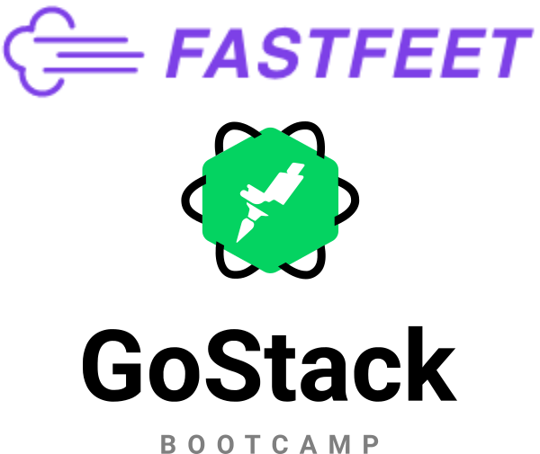
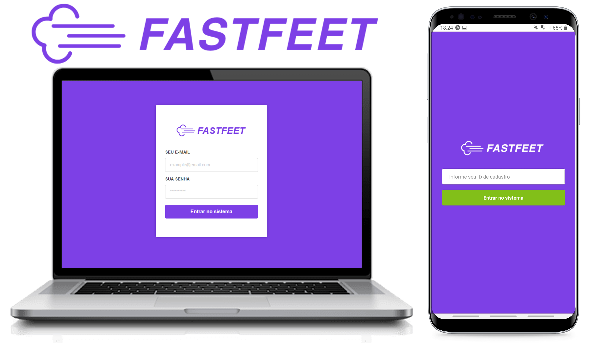
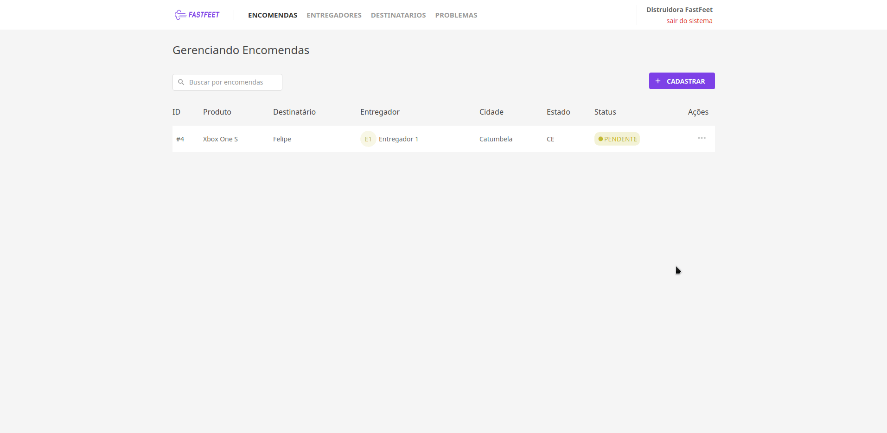

<h2 align="center">

  
  <br/>
  🚀 FastFeet Fullstack app
</h2>

<p align="center">
  <a href="https://github.com/felsantiago" target="_blank" >
    
  </a>
  <a href="https://www.linkedin.com/in/felipe-santiago-a7706418a/" target="_blank" >
    
  </a>
  <a href="mailto:fepuss@gmail.com" target="_blank" >
    
  </a>
  <a href="https://api.whatsapp.com/send?phone=5588997143829"
        target="_blank" >
    
  </a>
</p>

<div align="center">

</div>

<h1 align="center">
    
    
</h1>
<h1 align="center">
    
</h1>

## :book: About FastFeet

<p> This project is a full control system of a fictional shipping company called FastFeet. The full system has a web version made with ReactJS, where the admin is able to take control of all processes, from listing deliveries to handle with delivery problems and change deliverymen's info. The application also has a mobile version made with React Native, where the deliveryman is able to list all his deliveries filtering by pending or delivered, register a problem during the process and also confirm the deliver by sending a picture of the recipient's signature. All this system is served by a REST API made with Node.js</p>

## :rocket: Built with

This project was developed with the following technologies:

- [Node.js](https://nodejs.org/)
- [Express](https://expressjs.com/)
- [ReactJS](https://reactjs.org/)
- [React Native](https://facebook.github.io/react-native/)
- [Redux](https://redux.js.org/)
- [Redux-Saga](https://redux-saga.js.org/)
- [Redux-persist](https://github.com/rt2zz/redux-persist)
- [Styled-components](https://www.styled-components.com/)
- [React Navigation](https://reactnavigation.org/)
- [JWT](https://jwt.io/)
- [Immer](https://github.com/immerjs/immer)
- [Axios](https://github.com/axios/axios)
- [React-icons](https://react-icons.netlify.com/)
- [React-toastify](https://github.com/fkhadra/react-toastify)
- [Reactotron](https://infinite.red/reactotron)
- [Polished](https://polished.js.org/)
- [Yup](https://www.npmjs.com/package/yup)
- [Date-fns](https://date-fns.org/)
- [AWS S3](https://aws.amazon.com/pt/s3/)
- [Multer](https://github.com/expressjs/multer)
- [ESLint](https://eslint.org/)
- [Prettier](https://prettier.io/)
- [VS Code](https://code.visualstudio.com/)

## :information_source: Getting Started

### Requirements

To run the application you will need:

- [Git](https://git-scm.com)
- [Node](https://nodejs.org/)
- [Yarn](https://yarnpkg.com/)

I strongly recommend using [Docker](https://www.docker.com/) to run the databases.
<br>
If you decide to use docker, follow this steps to install and run the docker images.

```bash
# install Redis image
docker run --name imageName -p 6379:6379 -d -t redis:alpine

# install Postgres image (if you don't specify an username it will be postgres by default)
docker run --name imagename -e POSTGRES_PASSWORD=yourPassword -p 5432:5432 -d postgres

# start Redis
docker start imageName

# start Postgres
docker start imageName

```

### Backend

Now clone the repository and install the dependencies.

```bash
# to clone the repository
git clone https://github.com/felsantiago/fastfeet

# go into the backend folder
cd fastfeet/backend

#install the backend dependencies
yarn

```

In order to connect to the database, you will need to enter the access informations into a .env file, based on a .env.example file that is provided in the backend folder, change the variables according to your environment.

```bash
# run migrations
yarn sequelize db:migrate

# run seeds
yarn sequelize db:seed:all

# run api
yarn dev & yarn queue
```

### Frontend

```bash
# in another tab of the terminal install the frontend dependencies and run it
cd frontend
yarn
yarn start
```

Use this credentials to access the web application

<blockquote><strong>email:</strong> admin@fastfeet.com</blockquote>
<blockquote> <strong>senha:</strong> 123456</blockquote>

### Mobile

The Application was developed using Expo. It is a free and open source toolchain built around React Native to facilitate the process of running and testing applications. [Click here](https://expo.io/learn) to get start with Expo.

```bash
# install the dependencies
cd mobile
yarn
```

In order to run the application on your device, you need to change the ip config.

[api.js](https://github.com/felsantiago/fastfeet/blob/master/mobile/src/services/api.js)

```javascript
  baseURL: 'http://192.168.0.185:3333',
```

replace 192.168.0.185 with your machine's ip.

If you want to use Reactotron change the ip in the Reactotron config file.

[ReactotronConfig](https://github.com/felsantiago/fastfeet/blob/master/mobile/src/config/ReactotronConfig.js)

```javascript
  .configure({ host: '192.168.0.185' })
```

Now with everything on place, run the application.

```bash
# to run the app
yarn start
```

Expo will open a page in your browser, scan the QRcode on the page and wait for the app to load.
